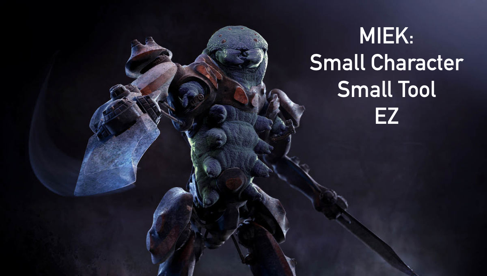

# README #


## What is Miek? ##

A fixed viewport image cropping library for Android with built-in support for [Picasso][picasso], [Glide][glide] or [Universal Image Loader][uil].
Forked from Lyft's [Scissors][scissors].

### Usage ###

Inset `image-crop-sample`


- Include it in your layout:
```xml
<co.steezy.miek.android.CropView
    android:id="@+id/crop_view"
    android:layout_width="match_parent"
    android:layout_height="match_parent"
    app:cropviewViewportRatio="1"
    />
```
-  Set a Bitmap to be cropped: `cropView.setImageBitmap(someBitmap);`
-  Get the cropped bitmap that matches viewport dimensions: `Bitmap croppedBitmap = cropView.crop();`

### Extensions ###

Miek comes with handy extensions which help with common tasks like:

#### Loading a Bitmap
To load a Bitmap automatically with [Picasso][picasso], [Glide][glide] or [Universal Image Loader][uil] into `CropView` use as follows:

```java
cropView.extensions()
    .load(galleryUri);
```
#### Cropping into a File
To save a cropped Bitmap into a `File` use as follows:

```java
cropView.extensions()
    .crop()
    .quality(87)
    .format(PNG)
    .into(croppedFile))
```

## How do I get set up? ##

<b>Prerequisites:
Have Android Studio Downloaded</b>

1. Open Android Studio
2. Select Check out project from version control > Git
3. Paste in the url of the repository https://github.com/steezyinc/miek.git
4. Fill out the directory to where you want the project saved
5. Import the project.

Once you've successfully imported the project, you should be able to develop and run the sample app. Happy Coding!

## Questions ##

* About Miek? Rod (rodrigo@steezy.co) ヽ(•̀ω•́ )ゝ
* About the code? Jolina (jolina@steezy.co)


 [picasso]: https://github.com/square/picasso
 [glide]: https://github.com/bumptech/glide
 [uil]: https://github.com/nostra13/Android-Universal-Image-Loader
 [scissors]: https://github.com/lyft/scissors
